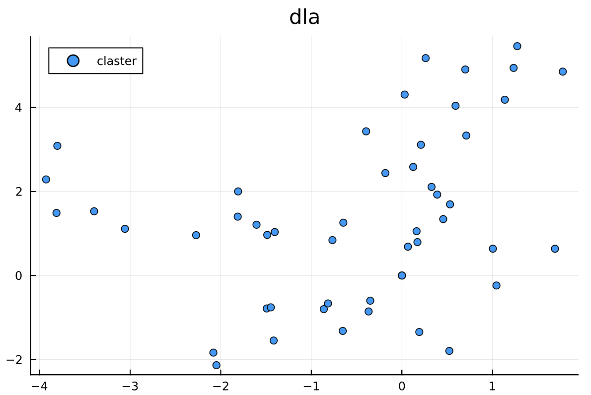
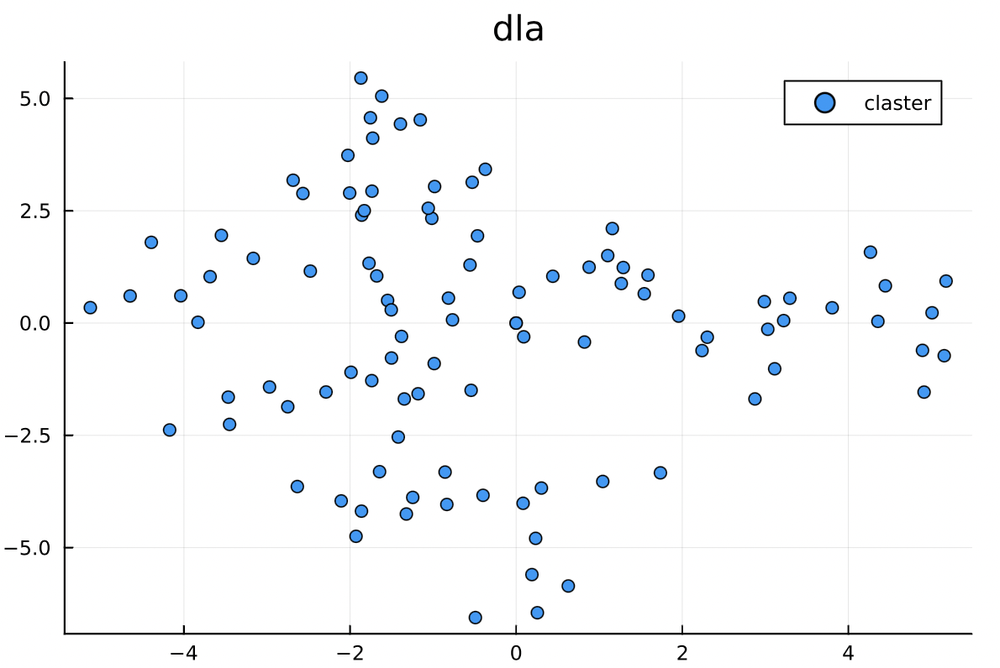

---
## Front matter
title: "Отчет по групповому проекту. Этап 4"
subtitle: "Неравновесная агрегация, фракталы"
author:
  - Шалыгин Г. Э.
  - Низамова А. А.
  - Голощапова И. Б.
  - Серегин Д. А.
  - Пиняева А. А
institute:
  - Российский университет дружбы народов, Москва, Россия
date: 11 марта 2023

## Generic otions
lang: ru-RU
toc-title: "Содержание"

## Bibliography
bibliography: bib/cite.bib
csl: pandoc/csl/gost-r-7-0-5-2008-numeric.csl

## Pdf output format
toc: true # Table of contents
toc-depth: 2
lof: true # List of figures
lot: true # List of tables
fontsize: 12pt
linestretch: 1.5
papersize: a4
documentclass: scrreprt
## I18n polyglossia
polyglossia-lang:
  name: russian
  options:
	- spelling=modern
	- babelshorthands=true
polyglossia-otherlangs:
  name: english
## I18n babel
babel-lang: russian
babel-otherlangs: english
## Fonts
mainfont: PT Serif
romanfont: PT Serif
sansfont: PT Sans
monofont: PT Mono
mainfontoptions: Ligatures=TeX
romanfontoptions: Ligatures=TeX
sansfontoptions: Ligatures=TeX,Scale=MatchLowercase
monofontoptions: Scale=MatchLowercase,Scale=0.9
## Biblatex
biblatex: true
biblio-style: "gost-numeric"
biblatexoptions:
  - parentracker=true
  - backend=biber
  - hyperref=auto
  - language=auto
  - autolang=other*
  - citestyle=gost-numeric
## Pandoc-crossref LaTeX customization
figureTitle: "Рис."
tableTitle: "Таблица"
listingTitle: "Листинг"
lofTitle: "Список иллюстраций"
lotTitle: "Список таблиц"
lolTitle: "Листинги"
## Misc options
indent: true
header-includes:
  - \usepackage{indentfirst}
  - \usepackage{float} # keep figures where there are in the text
  - \floatplacement{figure}{H} # keep figures where there are in the text
  - \usepackage[ruled,vlined,linesnumbered]{algorithm2e}
---

# Цель работы

Цель:

- Реализовать алгоритмы моделирования неравновесной агрегации.

Задачи:

- Рассмотреть возможности языков для программной реализации алгоритмов
- Реализовать алгоритмы, описанные втором этапе

# Теоретическое введение

## Постановка задачи

Существуют разнообразные физические процессы, основная черта которых — неравновесная агрегация. Примеры: образование частиц сажи, рост осадков при электрическом осаждении и т. п. Во всех случаях происходит необратимое прилипание частиц к растущему кластеру из-за сильного смещения равновесия в сторону твердой фазы, и вырастают разветвленные агрегаты (рост правильных ограненных кристаллов происходит в условиях, близких к равновесным, когда возможно как прилипание частиц, так и их обратный переход в раствор)

## Случайные блуждания

### Одномерные случайные блуждания

Рассмотрим простую модель — пусть частицы могут двигаться только вдоль прямой, делая шаги случайной длины. Примем также, что величина и направление каждого шага определяются независимо от положения частицы и от предыдущих шагов (модель «пьяного моряка»). Будем наблюдать за частицей через равные промежутки времени. Координата частицы вычисляется по рекуррентной формуле $x_k = x_{k−1}+\delta_k$, где $\delta_k$ — очередной шаг блуждания. При отсутствии силового поля смещение влево и вправо равновероятны. В общем случае вероятность того, что длина шага лежит в промежутке от #\delta$ до $\delta+d\delta$, равна $dp = w(\delta)d\delta$. Функция w называется плотностью вероятности для величины шага δ, который называют случайной величиной. 

Подробнее в [@qq].

### Многомерные случайные блуждания

Предоставим теперь нашим частицам возможность двигаться также по координате y — рассмотрим двумерные случайные блуждания (случай трех измерений получается аналогично). Можно независимо задавать смещение по вертикали $\delta_y$ равномерно распределенным таким же образом, как и смещение по горизонтали $\delta_x$ .

Функция распределения в двумерном случае представляется в виде произведения двух функций распределения по координатам x и y , так как x и y являются независимыми случайными величинами. Подробнее в [@qq].

## Фрактальная размерность

Фигура на плоскости или тело в пространстве имеют размерность. Определить ее можно разными способами. В случае, когда у фигуры есть выделенная центральная точка, можно построить много сфер различного радиуса с центром в этой точке. Для каждой сферы можно вычислить массу части фигуры, которая оказалась внутри этой сферы. В случае, когда масса пропорциональна радиусу сферы в некоторой степени ($m \sim R^D$), показатель степени D называется размерностью тела. Это так называемый метод сфер или ящиков. Для линий D = 1, у плоских фигур D = 2, у «обычных» тел D = 3. Однако, многие объекты в природе имеют размерность, выражающуюся дробным числом.

Такие тела, следуя Б. Мандельброту [9], называют фракталами (от латинского слова fractus — дробный). Фракталами являются также дендриты, вырастающие при электроосаждении металлов, кластеры, полученные при агрегации коллоидов; фрактальную структуру имеют ветви деревьев, кровеносная система и т. п.

Еще один способ может применяться при наблюдении за процессом роста агрегата от центра. В этом случае число частиц в кластере $N \sim R^D_{ch}$. В качестве характерного радиуса Rch можно выбирать, например, максимальный радиус кластера $R_{max}$,

Желающим более подробно познакомиться с фракталами рекомендуем книгу [@ww].


# Математические модели

## Агрегация, ограниченная диффузией

### Сеточная модель.

Возьмем регулярную сетку на плоскости, например, квадратную. В центр поместим затравочную частицу. Затем с достаточно большого расстояния будем выпускать по одной новые частицы. Выпущенная частица совершает случайные блуждания по сетке, делая шаги в одном из четырех доступных направлений с равной вероятностью. Если частица оказывается по соседству с затравкой, она прилипает и остается в этом узле. Затем выпускаем следующую частицу, которая может прилипнуть к одному из занятых узлов. Шаг решетки в этой модели соответствует длине связи между частицами (расстоянию устойчивого равновесия для взаимодействия двух частиц).

*Некоторые указания.* Для ускорения работы программы разумно выпускать частицы с круга радиусом немного больше Rmax — текущего максимального радиуса агрегата.

Если частица уходит далеко, уничтожаем ее и выпускаем новую.

### Бессеточная модель.

Структура полученных DLA-кластеров отражает структуру сетки (имеются выделенные направления). Чтобы получить более симметричные кластеры, можно отказаться от сетки. В этом случае рост происходит следующим образом: вначале помещаем в центр поля затравочную частицу, затем с круга некоторого радиуса выпускаем следующую, которая случайно блуждает. Если частицы сближаются на расстояние взаимодействия (например, их удвоенный радиус), они слипаются. После этого выпускаем новую частицу и т. д.

Детальная информация в [@mod]

### Химически-ограниченная агрегация

При диффузионно-ограниченной агрегации частица всегда прилипает к кластеру с вероятностью 1. Можно уменьшить вероятность прилипания. Такой процесс роста называется химически-ограниченной агрегацией. Он моделирует ситуацию, когда вероятность зависит от того, каким концом молекула повернута к другой. Это приведет к появлению более плотных агрегатов (увеличению размерности), потому что у частицы увеличится шанс проникать во внутренние области и заполнять пустоты. Размерность, однако, остается меньше размерности пространства, т. е. кластер остается фракталом.

### Баллистическая агрегация

До сих пор мы рассматривали рост кластеров с точечной затравки. Однако, довольно часто встречаются ситуации, когда агрегаты растут на поверхности, например, при выпадении осадка на дне или стенках сосуда. Если новые частицы доставляются к растущему кластеру за счет диффузии, имеем просто модель DLA с измененными начальными условиями.

Другой случай — *баллистическая агрегация*, при которой частицы свободно падают по прямолинейным траекториям. Частица прилипает, когда оказывается рядом с занятым узлом. В этом процессе получается более плотный агрегат (но не сплошной), однако его граница сильно изрезана и является фракталом.


# Прогамная реализация

## Используемые возможности языка Julia

Округление:
- round(x)	округление к ближайшему целому числуб typeof(x)
- round(T, x) округление к ближайшему целому числу	T
- floor(x)	округление x к -Inf	typeof(x)
- floor(T, x)	округление x к -Inf	T
- ceil(x)	округление x к +Inf	typeof(x)
- ceil(T, x)	округление x к +Inf	T
- trunc(x)	округление x по направлению к нулю	typeof(x)
- trunc(T, x)	округление x по направлению к нулю	T

Математические операции:
- abs(x) модуль
- sqrt(x), $\sqrt(x)$ квадратный корень x
- sin(x), cos(x)
- maximum(X), minimum(X) - максимум и минимум массивов

Макрос \@time позволяет измерить время работы функции.
Подробное описание в [@julia]

## Листинги используемых функций для модели DLA

### Генерация псевдослучайных чисел

```julia
next = 0
function rand()
	global next = (next * 1664525 + 1013904223) % 2^32
	return next / 2 ^ 32
end
```

### Генерация координат следующей частицы

```julia
function GetNextParticular(x_center, y_center, r)
	r = r
	angle = 2 * pi * rand()
	x = r * cos(angle) + x_center
	y = r * sin(angle) + y_center
	return round(x), round(y)
end
```

### Дополнительные функции

**Расстояние между точками $(x_1, y_1), (x_2, y_2)$**

```julia
function dist(x1, y1, x2, y2)
	return sqrt((x2-x1)*(x2-x1) + (y2-y1)*(y2-y1))
end
```

**Проверка того, что частица столкнулась с кластером**

```julia
function check(x, y)
	for i in 1:n
		if abs(X[i] - x) + abs(Y[i] - y) == 1
			return true
		end
	end
	return false

```

### Блуждание частицы

```julia
function RandomWalk(x, y, i, r, xl, xr, yu, yd)
	step = 1; dx = [1, -1, 0, 0]; dy = [0, 0, 1, -1]
	while step < 500 && dist(x, y, (xl + xr) / 2, (yu+ yd) / 2) < 4 * r
		if check(x, y)
			X[i] = x; Y[i] = y
			return true
		end
		j = floor(Int, 100 * rand()) % 4 + 1
		x = x + dx[j]
		y = y + dy[j]
		step += 1
	end
	return false
end
```

### Псевдокод модели DLA

```julia
function DLA(t)
	i = 1
	while i < t
		xl = minimum(X)
		xr = maximum(X)
		yu = minimum(Y)
		yd = maximum(Y)
		r = dist(xl, yd, xr, yu) / 2 + 3
		x, y = GetNextParticular((xr+xl)/2, (yu+yd)/2, r)
		ok = RandomWalk(x, y, i, r, xl, xr, yu, yd)
		if ok
			i += 1
		end
	end
end
```
## Другие модели

- **Бессеточная**: добавляется выбор случайной длины шага.
- **Химически-ограниченная**: вводится условие прилипания.

### Бессеточная

```julia
function RandomWalk(x, y, i, r, xl, xr, yu, yd)
    <...>
    	x = x + 2 * rand() - 1
		y = y + 2 * rand() - 1
    <...>
end
```

### Химически-ограниченная

```julia
function RandomWalk(x, y, i, r, xl, xr, yu, yd)
	<...>
    	if check(x, y) and random() > 0.2
			X[i] = x
			Y[i] = y
    <...>
end
```

# Анализ результатов

## Сеточная модель

### Кластеры 

Рассмотрим результаты работы кода для разных значений числа частиц $n$. 

| $50$  | {} | {} | {} |
| ----- | -------------------- | -------------------- | -------------------- |
| $100$ | {} | {} | {} |

| $200$ | {} | {} | {} |
| ----- | -------------------- | -------------------- | -------------------- |
| $500$ | {} | {} | {} |

Видно, что с увеличением $n$  получающийся кластер стремится к агрегату наблюдаемому в физических явлениях с неравновесной агрегацией. 

## Время выполнения, с

| $n$  | $t_1$ | $t_2$ | $t_3$ | $t_{avg}$ |
| ---- | ----- | ----- | ----- | --------- |
| 50   | 0.24  | 0.20  | 0.18  | 0.21      |
| 100  | 0.65  | 0.82  | 0.66  | 0.71      |
| 200  | 4.57  | 4.48  | 3.72  | 4.26      |
| 500  | 44.66 | 52.40 | 41.20 | 46.09     |


# Бессеточная модель

## Кластеры

| $50$  | {} | {} | {} |
| ----- | ------------------- | ------------------- | ------------------- |
| $100$ | {} | {} | {} |

## Кластеры

| $200$ | {} | {} | {} |
| ----- | ------------------- | ------------------- | ------------------- |
| $500$ | {} | {} | {} |

Получившиеся кластеры имеют бессеточную структуру, приближённую к реальным агрегатам. 

## Время выполнения, с

| $n$  | $t_1$ | $t_2$ | $t_3$ | $t_{avg}$ |
| ---- | ----- | ----- | ----- | --------- |
| 50   | 0.22  | 0.21  | 0.23  | 0.22      |
| 100  | 0.82  | 0.81  | 0.64  | 0.76      |
| 200  | 3.24  | 4.07  | 3.36  | 3.56      |
| 500  | 45.22 | 33.48 | 34.98 | 37.99     |

Построим график зависимости времени выполнения от числа частиц. 


Таким образом время возрастает нелинейно, а полиномиально или даже экспоненциально. 

# Фрактальная размерность

| $n$                | Сеточная | Бессеточная |
| ------------------ | -------- | ----------- |
| 50                 | 1.26     | 1.40        |
| 100                | 1.41     | 1.49        |
| 200                | 1.58     | 1.59        |
| 500                | 1.69     | 1.70        |
| **$\textbf{Avg}$** | **1.49** | **1.55**    |

С ростом числа частиц фрактальная размерност должна стремиться к 1.71, что можно увидеть в результате вычислительных экспериментов. ы

# Выводы

- Создан инструмент проведения вычислительынй экспериментов для изучения моделей неравновесной агрегации. 

- Полученные результаты согласуются  с эмпирическими данными. 

  

# Список литературы{.unnumbered}

::: {#refs}
:::
